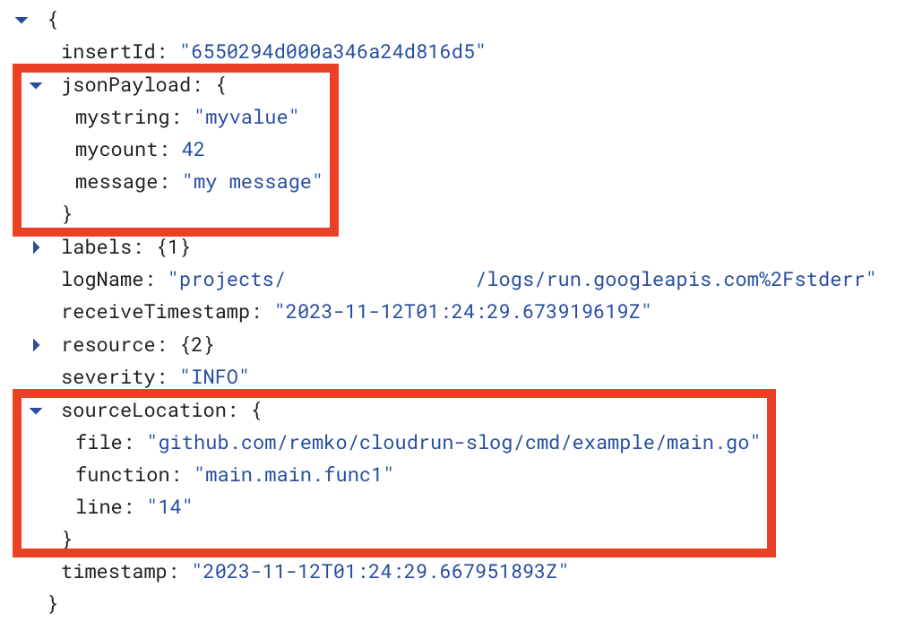
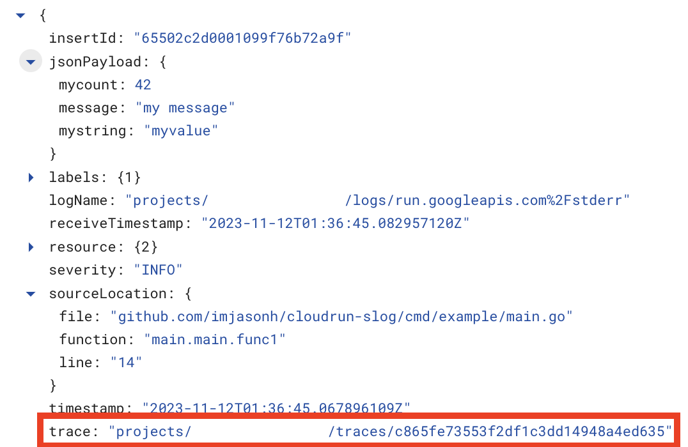

# `clog/gcp`: structured logging for Google Cloud using [`slog`](https://pkg.go.dev/log/slog)

Contrary to the
[documented "standard" approach for logging](https://cloud.google.com/logging/docs/setup/go),
this doesn't use any third-party logging package for logging.

Instead, it relies on Google Cloud's support for ingesting structured logs by
simply printing JSON to stderr.

This method of emitting structured logs is supported by:

- [Cloud Run](https://cloud.google.com/run/docs/logging#using-json)
- [Kubernetes Engine](https://cloud.google.com/logging/docs/structured-logging#special-payload-fields)
- [Cloud Functions](https://cloud.google.com/functions/docs/monitoring/logging#writing_structured_logs)
- [App Engine](https://cloud.google.com/logging/docs/structured-logging#special-payload-fields)
  (standard and flexible)
- and in other products, using the
  [Cloud Logging agent](https://cloud.google.com/logging/docs/agent/logging) and
  [Ops agent](https://cloud.google.com/logging/docs/agent/ops-agent).

## Basic Usage

To use this, underscore-import `gcp/init`, which will configure `slog` to use
the GCP-optimized JSON handler for all log messages:

Then when you use `slog`, all log messages will be output in JSON format to
standard error, which is automatically ingested by Cloud Logging.

```go
import _ "github.com/chainguard-dev/clog/gcp/init"

...

http.HandleFunc("/", func(w http.ResponseWriter, r *http.Request) {
  slog.InfoContext(r.Context(), "my message",
    "mycount", 42,
    "mystring", "myvalue",
  )
})
```

This logs the message, with the additional structured logging fields in Cloud
Logging:

<table><tr><td></td></tr></table>

## Correlating Logs with Requests

You can also use this to correlate log lines with the request that generated
them, by associating the log message with the request's trace context header.

```go
import "github.com/chainguard-dev/clog/gcp"

...

http.Handle("/", gcp.WithCloudTraceContext(http.HandlerFunc(func(w http.ResponseWriter, r *http.Request) {
  slog.InfoContext(r.Context(), "my message",
    "mycount", 42,
    "mystring", "myvalue",
  )
})))
```

This logs the message, associated with the request's trace, in Cloud Logging:

<table><tr><td></td></tr></table>

Other logs with the same `trace` attribute are generated by the same incoming
request.

See https://cloud.google.com/trace/docs/trace-log-integration for more
information.

## Critical Logging

Cloud Logging supports a **CRITICAL** logging level, which doesn't map cleanly
to `slog`'s built-in levels.

To log at this level:

```go
slog.Log(ctx, gcp.LevelCritical, "I have a bad feeling about this...")
```

See `./cmd/example` for a deployable example.

---

This repo is forked from https://github.com/remko/cloudrun-slog, which
originated this idea and implementation.
